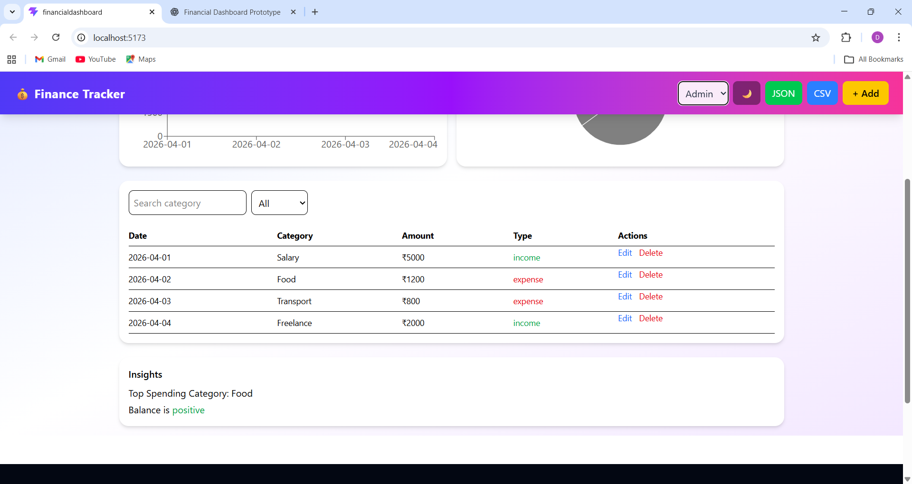
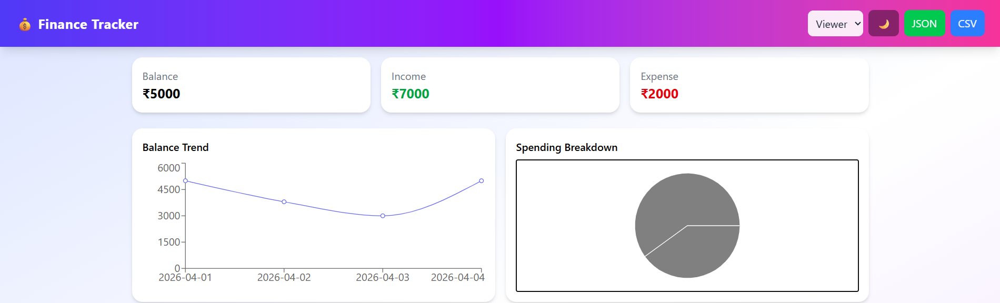
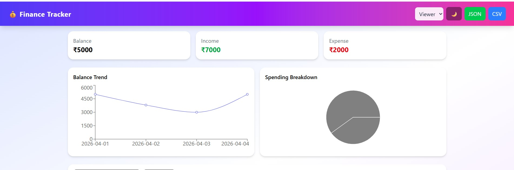
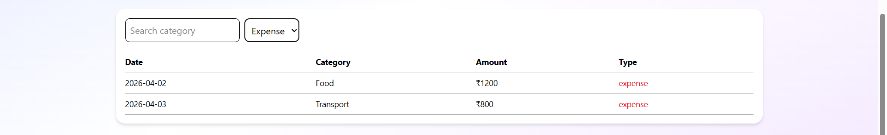
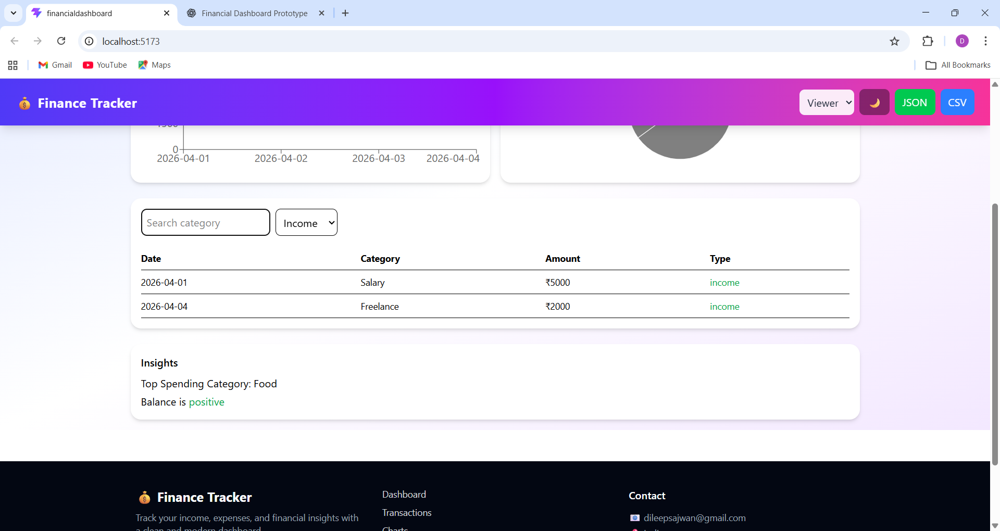
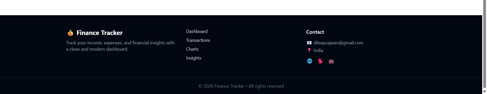

# 💰 Finance Dashboard
=======
## Financial Dashboard


A modern, responsive financial dashboard built with React and Tailwind CSS that helps users track income, expenses, and spending insights in a clean and interactive way.

---

## Live Features

### Dashboard Overview

- View **Total Balance, Income, and Expenses**
- **Balance Trend Chart** (time-based visualization)
- **Spending Breakdown** (category-wise chart)

---

### Transactions Management (CRUD)

- Add transactions (via modal form)
- Edit existing transactions
- Delete transactions
- Search by category
- Filter by type (Income / Expense)

---

### Role-Based UI (Simulated)

- Viewer → Can only view data
- Admin → Can add, edit, and delete transactions

Switch roles using the dropdown in the Navbar.

---

### Dark Mode

- Toggle between light and dark themes
- Smooth UI transition
- Persistent across sessions

---

### Data Persistence

- Uses **LocalStorage**
- Data is saved automatically
- No data loss on refresh

---

### Mock API Integration

- Simulates backend data fetching
- Adds realistic delay for loading experience

---

### Export Functionality

- Export transactions as:
  - JSON file
  - CSV file

---

### Advanced Filtering

- Combine:
  - Search (category)
  - Type filter (income/expense)

---

### Insights Section

- Highlights:
  - Highest spending category
  - Overall financial status

---

## Tech Stack

- **Frontend:** React (JavaScript, JSX)
- **Styling:** Tailwind CSS
- **Charts:** Recharts
- **State Management:** React Hooks (`useState`, `useEffect`, `useMemo`)
- **Data Storage:** LocalStorage

---

## Folder Structure

```
src/
│── components/
│   ├── SummaryCards.jsx
│   ├── Charts.jsx
│   ├── Transactions.jsx
│   ├── TransactionModal.jsx
│   ├── Insights.jsx
│
│── pages/
│   └── Dashboard.jsx
│
│── data/
│   └── sampleData.js
│
│── App.jsx
```

---

---

## Screenshots









## Setup Instructions

### 1️ Clone the Repository

```bash
git clone https://github.com/Dileepsajwan/financial-dashboard.git
cd financial-dashboard
```

### 2️ Install Dependencies

```bash
npm install
```

### 3️ Run the Project

```bash
npm run dev
```

---

## Responsiveness

- Fully responsive layout
- Works across:
  - Desktop
  - Tablet
  - Mobile

---

## Key Highlights

- Clean and modular architecture
- Real-world features (CRUD + persistence)
- Role-based UI simulation
- Export functionality (CSV/JSON)
- Smooth animations and transitions

---

## Future Improvements

- Toast notifications (success/error)
- Delete confirmation modal
- Date range filtering
- Advanced analytics (monthly trends)
- Backend integration (Node.js / Firebase)
- Deployment (Vercel)

---

## Author


Dileep Kumar
Frontend Developer

---

## Feedback

If you like this project, feel free to ⭐ the repo and share your feedback!

---
